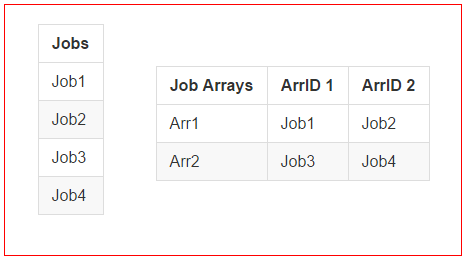

# Job Arrays 

- do not submit moe than 5000 jobs to gimzo
- to run 40000 jobs submit 40 job arrays with 1000 elements each

---

# What is slowing us down?

- jobs require input files that need to be prepared (wait for prep, then 
  start the real job)

---

# Centipede Slurm example

- Centipede is a shell script that can make using a Slurm cluster much 
  easier.
- Using the centipede command one can submit many thousand short running 
  jobs to a Slurm HPC cluster. 
- The script goes through all 4 phases of a typical HPC pipeline which 
  needs to split up the computational work across many nodes. 

---

# The 4 phases are:

1. **Data preparation**
   Input files are not available in an expected format and need to be
   prepared. 
2. **Parallel execution**:
   The computational problem needs to be split up into many smaller 
   problems that can be distributed to many compute nodes. 
3. **error correction**:
   A small percentage of jobs often fails. The script should detect this
   failure and rerun only the failed jobs 
4. merge of data 
   
---

# Command arguments for SCRIPT

- Centipede assumes that you want to launch another script (e.g. using R
  or Python) which is set in the SCRIPT variable. 

- It assumes that SCRIPT takes several command line args each of which 
  tell SCRIPT to execute one of the 4 different phases. 

---

# Arguments for example.R:

-  Phase 0: ./example.R listsize  (get array size - not run via slurm)
-  Phase 1: ./example.R prepare   (initial data preparation)
-  Phase 2: ./example.R run xx    (run $listsize # of jobs)
-  Phase 3: ./example.R run xx    (run only the failed jobs with no outfile) 
-  Phase 4: ./example.R merge     (merge the output files) 

---

scentipede can take 2 arguments, SCRIPT and JOBNAME.

    !bash
    JOBNAME='myJob'      # change for every analysis you run (2nd arg)
    MAILDOM='@fhcrc.org' # your email domain (for receiving error msg)
    MAXARRAYSIZE=1000    # set to 0 if you are not using slurm job arrays
    MYSCRATCH="./scratch/${JOBNAME}"  # location of your scratch dir
    PARTITION='restart'  # a queue on your cluster for very short jobs
    RESULTDIR="./result/${JOBNAME}"  # A permanent storage location
    SCRIPT='./example.R' # your code as (R or Python) script (1st arg)
    STEPSIZE=2           # number of consequtive loops in SCRIPT to run in
                         # the same job / node (increase for short jobs)
                         
to start the python example without editing the script, run it like this:

    ./scentipede ./example.py myFirstPyJob
                         
---

# Presentation
- This readme is also a [presentation](http://fredhutch.github.io/slurm-examples)

---

# Configuration
Before and during implementation, we kept the following goals in mind:

---

# meh

---

# The restart queue 

- access to  > 1000 cores  
- Jobs are only running if there are enough free resources 
- jobs get killed if not enough resources in priority queue (campus)
- the average run time of jobs that were killed is more than 1h 

---

# Environment vars in your code 

    !R
    #! /usr/bin/env Rscript

    # get environment variables
    MYSCRATCH <- Sys.getenv('MYSCRATCH')
    RESULTDIR <- Sys.getenv('RESULTDIR')
    STEPSIZE <- as.numeric(Sys.getenv('STEPSIZE'))
    TASKID <- as.numeric(Sys.getenv('SLURM_ARRAY_TASK_ID'))

    # set defaults if nothing comes from environment variables
    MYSCRATCH[is.na(MYSCRATCH)] <- '.'
    RESULTDIR[is.na(RESULTDIR)] <- '.'
    STEPSIZE[is.na(STEPSIZE)] <- 1
    TASKID[is.na(TASKID)] <- 0

---

# Environment vs command line 

- environment variables are inherited by all processes (scripts) launched
  by the current script, MYSCRATCH is valid for centipede and example.R
  
- command line arguments need to be explicitly passed they are not implicitly 
  inherited from from a parent process 
  
- Rule of thumb: Use environment variables for variables that do not change
  such as the scrathc folder and command line arguments for things that 
  change such as a loop interator, etc
  
---

# Save to tmp file and rename !

    !R
    for (i in (id+TASKID):(id+TASKID+STEPSIZE-1)) {
        print(paste(i, Sys.time(), TASKID, STEPSIZE, sep="   "))
        myrnd <- sample(i:10000,1,replace=T)        
        # save to a temp file and then rename it as last action !
        save(myrnd, file=paste0(MYSCRATCH,'/run/',i,"-run.dat.tmp"))
        file.rename(paste0(MYSCRATCH,'/run/',i,"-run.dat.tmp"),
                    paste0(MYSCRATCH,'/run/',i,"-run.dat"))
    }

 renaming  ist fast, interuption unlikely
 
 
